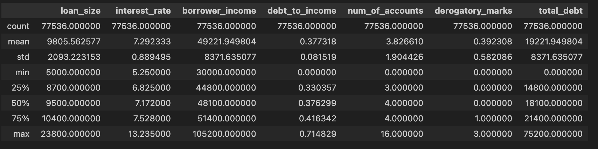

# credit-risk-classification
Bootcamp Module 12 homework on Supervised Learning

## Introduction to the Analysis

In this Challenge, we use logistic regression to train and evaluate a model based on loan risk. This assignment uses a dataset of historical lending activity from a peer-to-peer lending services company to build a model that can identify the creditworthiness of borrowers. i.e. is the  loan a *"healthy"* or *"high risk"*?

## The Dataset
### Input features
The dataset used in this exercise contains 77536 fully labelled examples which has the following features:
- loan_size: The size of the loan the borrower has
- interest_rate: The interest rate
- borrower_income: Income of the borrower
- debt_to_income: Ratio of current debt to income of the borrower
- num_of_accounts: Number of loan accounts of the applicant
- derogatory_marks: A score of credit history which include missed or late bills or repayments. A higher derogatory mark is less favourable.
- total_debt: Current total debt of the applicant.

The following scatter matrix of these features crossplots each of these features against each other to provide a sense of how these features correlate to one another. The diagonal matrix indicates the histogram of the distribution of the feature. It is clear that the dataset is synthetic, as the relationships between each of the features has no scatter.

### Target feature

The target feature is the "loan_status" column in the dataset which happens to be the last column. There are only two categories:

| loan_status | Definition | Count|
|-------------|------------|------|
|0  | Healthy loan | 75036 |
|1  | High Risk Loan   | 2500 |
| | **Total** | **77536** |

## Methodology
1. Scale the dataset. The raw feature dataset has features which differ in magnitude, units and variance. The following images display "before" and "after" scaling.

2. Splitting the dataset into training and testing sets. In this exercise I use the scikit-Learn `train_test_split` function test dataset is leave the test dataset to the default size of 25% of the dataset
3. Model training (fit) using logistic regression. 

## Results

The following confusion matrix is produced by using the scaled dataset

Overall, the logistic model has an accuracy of 0.995. 

| Prediction Category | Precision | Recall |
|----|----|-----|
| Healthy Loan | 18699/(18669+14)=0.999 | 18699/(18699+90)=0.995 |
| High Risk Loan |  611/(611+90)=0.872 | 611/(611+14)=0.978 |

## Summary

The logistic model presented here performs very well on this synthetic dataset with a high accuracy score of 0.995. In particular the healthy loan prediction and recall score is outstanding. The *"High Risk"* loan predictions have precision and recall scores which are not quite as high. 

The main purpose of this analysis is reliably predict *high risk* loans as these type of loans pose the greatest financial risk to lenders. Given this synthetic dataset, this model can predict *high risk* loans with high precision 0.872 which means that the model will correctly predict *high risk* loans 87.2% of the time. The *recall* percentage of *high risk* loans is 0.978 which means out of all the predicted *high risk* loans, 97.8% of these predictions will be correct.

Before I could recommend this model, I would like to see this model trained and run on a real world dataset, not a synthetic relationship dataset. The extremely high scores of "accuracy", "precision" and "recall" parameters reflect the synthetic dataset.